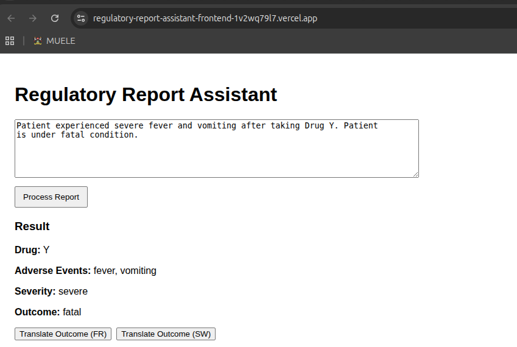
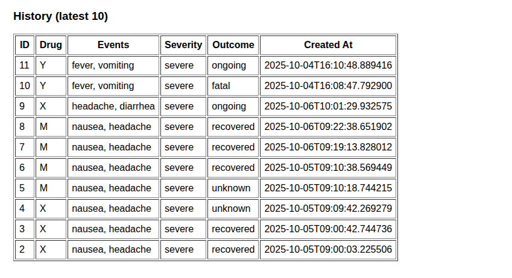
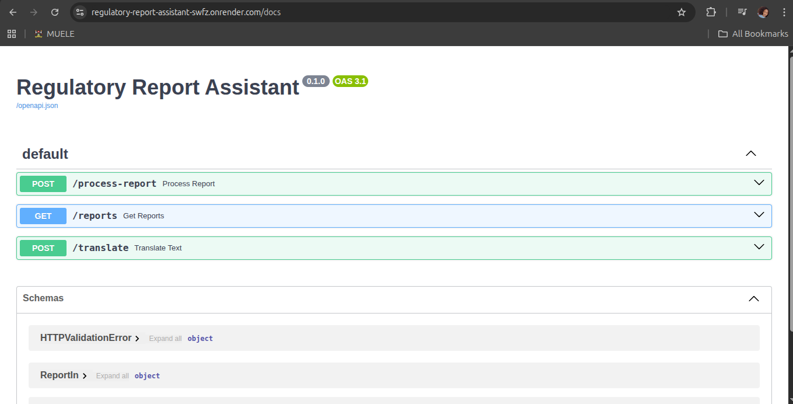

# Regulatory Report Assistant.

This starter project contains a simple backend (FastAPI) and a frontend (React) to implement
the "Mini Regulatory Report Assistant" take-home assignment.

## Structure
```
regulatory-report-assistant/
├── backend/
│   ├── app.py
│   └── requirements.txt
├── frontend/
│   ├── package.json
│   ├── public/index.html
│   └── src/
│       ├── index.js
│       └── App.js       
└── README.md
```

## Backend (Python / FastAPI)

### Setup
1. Create and activate a virtual environment (recommended):
   ```bash
   python -m venv venv
   source venv/bin/activate   # Linux
   ```

2. Install dependencies:
   ```bash
   pip install -r backend/requirements.txt
   ```

3. Run the backend:
   ```bash
   uvicorn backend.app:app --reload
   ```
   The API will be available at http://127.0.0.1:8000
   Open http://127.0.0.1:8000/docs to see interactive API docs.

### Endpoints
- `POST /process-report`  — accepts JSON `{ "report": "..." }` and returns structured fields.
- `GET /reports`          — returns saved reports (SQLite).
- `POST /translate`      — accepts `{ "text": "...", "lang": "fr"|"sw" }` and returns a simple translation.

## Frontend (React)

### Setup
1. In the `frontend/` folder run:
   ```bash
   npm install
   npm start
   ```
2. The React app expects the backend to run at `http://127.0.0.1:8000`.

### Live Demo
Backend: https://regulatory-report-assistant-swfz.onrender.com/docs
Frontend: https://regulatory-report-assistant-frontend-c7ji9pphi.vercel.app


## Screenshots


